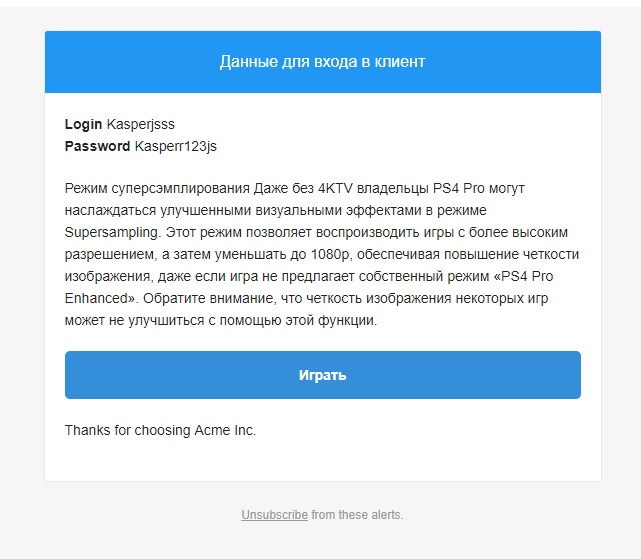

## API-Plugin

##### Отправка Email По шаблонам
- url: ./sendmailInfo

```js
POST: {
	    "user" : "5b2d0f0a112a44177ded0042",
	    "msg" : "Режим суперсэмплирования \r\n Даже без 4KTV владельцы PS4 Pro могут.....",
	    "header" : "Данные для входа в клиент"
	   }

```
<details>
<summary>EMAIL</summary>

</details>

___

##### Купить такую же подписку
- url: /extendpay

```js

POST: { "subscriptions" : "...."}

res.send(`https://qiwi.com/payment/form/99?extra%5B%27accou`);

```
___


##### Paymens Hhistory
- url: /paymenthistory

```js
POST: { "user" : "...."}
```
```js
res.setHeader('Content-Type', 'application/json');
res.send(JSON data);

```
<details>

<summary> JSON data </summary>

```json
[
	{
        "name": "Monthly",
        "price": "99999",
        "status": "processing",
        "active": "true",
        "subscriptions": {
            "start_date": "В прошлую субботу, в 22:24",
            "end_date": "21.07.2018"
        }
    },
	{
        "name": "Weekly",
        "price": "1500",
        "status": "processing",
        "active": "true",
        "subscriptions": {
            "start_date": "В прошлую субботу, в 22:24",
            "end_date": "21.07.2018"
        }
    },
    {
        "name": "Hourly",
        "price": "50",
        "status": "success",
        "active": "true",
        "subscriptions": {
            "start_date": "В прошлую субботу, в 22:18",
            "end_date": "В прошлую субботу, в 22:48"
        }
    }
]

```


</details>

____


##### Я хочу играть
- url: /gotoplay


```js
FindUsersubscriptions(active: true)
	if(nill){
	return redirect(200, 'http://i-teka.com/pay');
	}
	UpdateVpncredentials(active = true)

res.sendStatus(200);
```
___


##### DEMO доступ на 30минут
- /createdemo
```js
POST: { "consoleGroup" : "....", "uid" : "...." }
```
```js
Проверка: CheckDemoHistory if(err) return ("Демо доступ уже использован")
ОК = > FindConsole() => if(err) return ('К сожалению все консоли заняты')
OK = > UpdateConsole(id, false) //резервируем консоль
OK = > UpdateVpncredentials(active = true) //активируем VPN
OK = > CreateSubscript() // создать Subscription на 30минут
return Status(200);
```
___
##### __`Регистрирует пользователя + Vpncredentials + отправка данных на почту`__

- url: /createuser
```js
POST: { "email" : "...."}
```
___
##### Оплата QIWI
- url: /payqiwi

```js
POST: {USER"id" : "..." "consoleGroup" "...", "paytyp": "..."}
```

```js
return res.send('https://qiwi.com/payment/form/99?extra.....')

PayCheck()=>
	SuccesPay() =>
		createSubscript()// создать Subscriptions
		PaymentsUpdate('success') // обновить статус платежа на выполнен
		UpdateVpncredentials(true) // активировать VPN
if(err)
	Failed() =>
		PaymentsUpdate("Failed") // обновить статус платежа на провален
		updateConsole (true) // вернуть зарезервированую консоль на место
```
